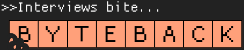

# Project Title
ByteBack

## Overview

We all know that interviews bite, now is your change to ByteBack with the next generation interview prep
tool. This interactive web app is designed to help tech graduates prepare for those daunting technical interviews with tailored flash cards, algorithm prompts, and bytes of advice for interview success. 

### Problem Space

Interviews are stressful enough as they are, this tool is designed to help candidates prepare for those 
difficult technical interviews based on the specific job title and/or skill set defined in the job description. The app features three main sections, a flashcard based game which tests the user on multiple choice, and true/false questions, a debugger, and a coding challenge. The flashcards can be randomized based on the job title (ie. Jr. Software Engineer), or filtered based on the specific skill sets (ie. React, mySQL, HTML, CSS) required for the role. The live debugger gets the users brain focusing on syntax and flow as they need to correct the issues hidden throughout the provided code. Select from a wide variety of coding languages such as JavaScript, TypeScript, Python and more to train the skills you need. Lastly the algorithm question challenges the user to test their coding skills in a functional code editor that allows them to run their code, with hints about the expected output to help them along. 

### User Profile

- Candidates for roles in the tech field:
    - New graduates looking for their first role
    - Candidates who are moving into a new field
    - Those that struggle with interview anxiety
    - Overacheivers looking to absolutely kill an interview
    - Myself and my brainstation cohort 

### Features

(General)
- As a user, I want to be able to select from a series of job titles that matches my own
- As a user, I want to be able to define the experience level or seniority of the role I'm prepping for
- As a user, I want to be able to select specific skills or competencies to be tested on

(Flashcards)
- As a user, I want to be able to define the length of the test (10, 15, 25, 30 questions)
- As a user, I want to be given the correct answer if I get a question wrong
- As a user, I want to be able to see my test results broken down into topics (HTML, React, Node.js)
    HTML 5/5    React 4/5   Node.js 2/5

## Implementation

### Tech Stack

-React
-JS
-Express
-MySql2
-Client Libraries:
    -react
    -react-router
    -axios
    -Monaco
    -@Chakra-ui
    -@emotion
Server Libraries:
    -express
    -knex
    -dotenv

### APIs

MVP approach uses a static database of questions organized by job title/skill category

Future implementation will include the use of Google Gemini/OpenAi, or other AI models to create a dynamic link to an AI chatbot through prompt engineering
where the user would be able to input their specific job title, and or job description, and get feedback on their algorithm. 

### Sitemap

- Landing Page (Select job title and skills)
- Flashcard page (select number of flashcards and take quiz)
- Results page (provides breakdown of score for each section)
- Debugger (Contains code editor with short debugging challenges (JS, TS, Python, Java, ...))
- Algorithm Challenge (Contains code editor and a set coding challenge)

### Mockups

### Data

The data is separated into five different tables: jobs-titles, skills, job-skills, questions, answers, debugging code, and code challenges. Each table is connected through the use of foreign keys. The debugging and coding challenges are independent tables and only have a unique id. An example of the data flow and an example of populated tables has been included below.  

The first SQL database diagram shows the initial data flow. The final version was updated to reflect the actual final db structure. 

### Endpoints

The following endpoints represent the MVP approach where the initial seed data is pre-populated for a select number of job titles. Future addition of a prompt based AI model will be researched and implemented once the basic functionality of the front end and back end are complete. 

GET / jobTitles
- Will populate the drop down menu for the user to select from the list of predefined jobs

Response:
[
    {
        "id": 1,
        "title": "Back-end Web Developer"
    },
    ...
]

GET / jobSkills/:id
- Will create an array of buttons representing the skills commonly related to that job description (user can select up to 5)

Response:
[
    {
        "id": 1,
        "job_id": 1,
        "skill": "JavaScript (Node.js)",
        "category": "Programming Languages"
    },
    ...
]

GET / relatedQuestions/:skillId
- Will return an array of evenly distritbuted questions dependent on the number of flashcards specified
 ie. if 10 questions are selected, there will be two from each skill selected.
- Will return a joined array 

 Response:
[
    {
        "id": 1,
        "skill_id": 1,
        "question": "What is the purpose of a web server?",
        "skill_name": "Back-end development"
    },
        {
        "id": 2,
        "skill_id": 6,
        "question": "Which HTTP method is used to create a new resource?",
        "skill_name": "Express.js"
    },
    ...
]

GET / answers/:questionId
- For each question, the answers will populate and will be displayed as clickable links. For each answer, an attached boolean expression will indicate the correct answer.

 Response:
[
    {
        "id": 1,
        "question_id": 1,
        "answer": "To handle client requests and serve files",
        "is_correct": "0"
    },
        {
        "id": 2,
        "question_id": 1,
        "answer": "To design user interfaces",
        "is_correct": "1"
    },
    ...
]

useStates in the front end will keep track of the number of correct and incorrect answers for each 
category. Once the quiz is finished, an overview of the results will be given showing users where they need to improve including a breakdown of the questions they got wrong. 

## Roadmap

Timeline below is subject to changes. Time estimates given will most likley be for the initial setup. 
Testing, iterating, and cleaning up time may exceed the given times. 

- (1 hour) Set up front end repo and react app
    - Add all dependencies, connect to remote git repo
    - Add all necessary pages/components

- (1.5 hours) Create site styling, organize all necessary assets, create partials (varibles, global, mixins)

- (1 hour) Set up back end repo and express server
    - Define folder structure, create all empty controllers/index/routes that will be required

- (2-3 hours) Compile all static seed data starting small (two job titles) and ensure formatting is compatible with 
sql databases

- (2-3 hours) Set up my database, create the migration folders which will join the necessary tables for my get requests

- (2-3 hours) Create back end api calls and test functionality using thunderclient

- (3 hours) Build landing page design (client side)

- (3 hours) Build flashcard page design (client side)

- (3 hours) Connect landing page to server

- (3 hours) Connect flash cards to server

- (2 hours) Test functionality (does not include fixes)

- (5 hours) Fix bugs

- (1.5 hours) Get site deployed on heroku and netlify for demo

---

## Future Implementations

The MVP approach will be to create a server side database using mySql which will house all of the seed data populated through chatgpt text prompts. Throughout the week following up to the acceptance of the proposal, research will be conducted to see the potential for adding in a 
direct ai prompt model. 

Continuation of this project will include the integration of a chatAi to dynamically update the job and skills data based on the users text input. 

    In this case, The inputs defined above would be adjusted to:
    - containing a search bar to input the exact job title,
    - text box for inputting job description to extract job requirements

